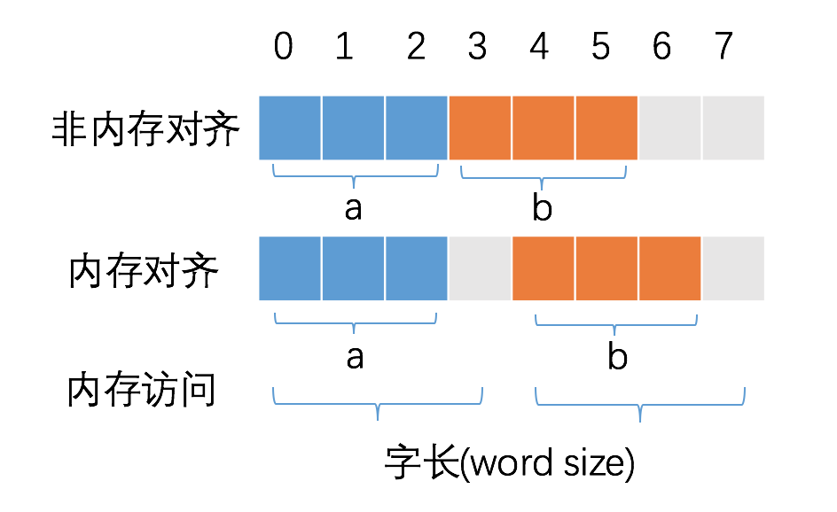

### 一、mutex 的使用

mutex 对象可以通过匿名方式嵌入到 struct 中，嵌入后不需要初始化就直接调用 Lock() 和 Unlock() 方法。


1、mutex 对象的基本用法

 mutex 包只有两个方法：Lock() 和 Unlock()，用来对临界区加锁。

```
m.Lock()
// xxx
m.Unlock()
```


2、四种常见错误

常见的 4 种错误场景我总结了一下，使用 Mutex 常见的错误场景有 4 类，分别是 Lock/Unlock 不是成对出现、Copy 已使用的 Mutex、重入和死锁。下面我们一一来看。


3、对锁的扩展

（1）增加 tryLock 功能，避免等待：锁是性能下降的“罪魁祸首”之一，所以，有效地降低锁的竞争，就能够很好地提高性能。因此，监控关键互斥锁上等待的 goroutine 的数量，是我们分析锁竞争的激烈程度的一个重要指标；

（2）扩展为可重入锁：可重入锁一般在递归或某些场景中使用；


4、读写锁相关的几个问题

    1.读写锁用过吗，读写锁用在什么样的场景？（或读写锁主要用来解决什么问题，说说对读写锁的理解？）
    2.说说RWMutex的实现原理？说说RWMutex与Mutex的区别？
    3.RWMutex源码看过吗？如果使用Mutex来设计一个RWMutex你有什么思路？
    4.在执行Lock，Unlock，Rlock，RUnlock时需要考虑什么问题？
    5.使用读写锁时如何规避死锁问题？
    6.如何监控读写锁的等待情况？你有什么思路？


### 二、atomic 的使用

1、使用 atomic 与 mutex 的区别

有些操作可以使用加锁实现也可以使用 atomic 原子操作实现，两者区别之处是什么？首先在使用上 mutex 是对一段代码进行加锁的，而 atomic 是对一个对象进行原子操作的。

原子操作由**底层硬件**支持，而锁则由操作系统的**调度器**实现。锁应当用来保护一段逻辑，对于一个变量更新的保护，原子操作通常会更有效率，并且更能利用计算机多核的优势，如果要更新的是一个复合对象，则应当使用`atomic.Value`封装好的实现。

原子操作是无锁的，常常直接通过CPU指令直接实现。

使用互斥锁和通道的思路都是在线程获得到访问权后阻塞其他线程对共享内存的访问，而使用原子操作解决数据竞争问题则是利用了其不可被打断的特性。

2、atomic 使用示例
```
	var t uint32
	var wg sync.WaitGroup
	for i := 0; i < 10000; i++ {
		wg.Add(1)
		go func() {
			defer wg.Done()
			atomic.AddUint32(&t, 1)
		}()
	}
	wg.Wait()
	fmt.Println(atomic.LoadUint32(&t))
```


```
var ApproveWindows atomic.Value

// validateApproveWindows
func (cm *constraintManager) startApproveWindowsTicker() {
    ticker := time.NewTicker(approveWindowsTicker)
    defer ticker.Stop()

    ctx := context.Background()
    defer ctx.Done()

    for {
        select {
        case <-ctx.Done():
            return
        case <-ticker.C:
            approveWindows, err := cm.opt.WhiteListStatus.ListApproveWindows(ctx)
            if err != nil {
                glog.Error("list approve windows failed with:%v", err)
                break
            }
            // atomic 
            cm.ApproveWindows.Store(approveWindows)
        }
    }
}


// use cache
var approveWindows []storagetypes.ApproveWindow
if cm.ApproveWindows.Load() != nil {
    approveWindows = cm.ApproveWindows.Load().([]storagetypes.ApproveWindow)
} else {
    var err error
    approveWindows, err = cm.opt.WhiteListStatus.ListApproveWindows(ctx)
    if err != nil {
        return false, "", err
    }
}
```

### 三、内存对齐

CPU 访问内存时，并不是逐个字节访问，而是以字长（word size）为单位访问。比如 32 位的 CPU ，字长为 4 字节，那么 CPU 访问内存的单位也是 4 字节。64 的字长为8字节。

简言之：合理的内存对齐可以提高内存读写的性能，并且便于实现变量操作的原子性。

</img>


参考：

https://hjlarry.github.io/docs/go/lock/

https://mp.weixin.qq.com/s/pQBsAxnaBXkk7G1cdUgsww

https://geektutu.com/post/hpg-struct-alignment.html
