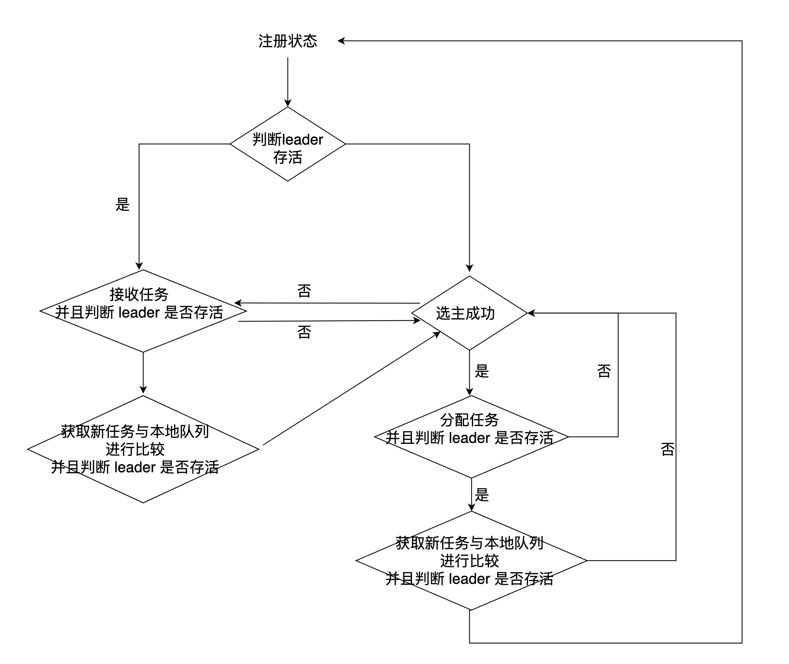
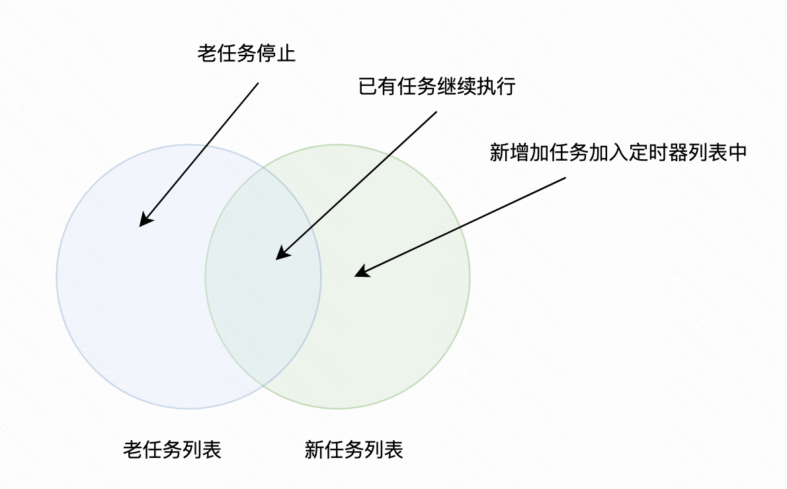

####  背景

服务画像当前所有任务仅会被leader实例执行，其余5个实例都处于 backup 状态，该场景会造成 leader 压力过大负载高，任务执行时间较长，backup 都处于空闲状态导致资源浪费。在 leader 节点进行切换时，新 leader 的负载瞬间会变高尤其是内存突增，启动时需要消耗200G+内存，容易造成实例所在的节点内存紧张甚至 oom。

## **目标**

将所有任务均衡分配到所有实例上，避免只有 leader 执行所有任务以及leader负载过高问题。

 **详细设计**

</img>

增加一张表，记录实例注册信息、leader 信息、task 分配信息：

| holder_identity | task_list | task_type（新任务 or 老任务） | renew_time | is_leader |
| --------------- | --------- | ----------------------------- | ---------- | --------- |
|                 |           |                               |            |           |
|                 |           |                               |            |           |

#### **开发流程：**

1、所有存活实例定时上报心跳，更新心跳信息到实例注册表，然后参与选主 （where leader = my_instance）

2、leader 分配任务功能（需要动态分配任务），实例存在变化时重新分配任务；

3、各slave定时获取自己的 task，然后动态执行 task，cron 包需要支持 add 、delete 等功能

验证定时任务执行过程中能够停掉

slave： 接收任务、判断leader是否存活参与选主、选到主之后停止之前的任务、重新分配任务（需要判断自己是否为主，避免脑裂之类的问题）、再次接收任务（需要判断自己是否为主）

#### **上线流程:**

1、 先上线注册以及选主流程，避免首次上线只有一个主执行所有任务

2、再上线任务分配流程

注：

2、注意边界条件处理，sql 中使用 where 判断实例状态中的leader是否与数据库中的一致；

## **测试**

| 主要功能                                           | 功能测试                                                     | 测试结果                                                     |      |      |
| -------------------------------------------------- | ------------------------------------------------------------ | ------------------------------------------------------------ | ---- | ---- |
| 单实例抢占leader                                   | 单实例抢占leader与任务分配                                   | 暂无异常                                                     |      |      |
| 多实例抢占leader                                   | 1、已有 leader时新增加实例；                                 | 暂无异常                                                     |      |      |
| 2、已有 leader时停止老实例；                       | 暂无异常                                                     |                                                              |      |      |
| 3、停止 leader是否正常进行抢占；                   | 暂无异常                                                     |                                                              |      |      |
| 多实例任务分配：                                   | 1、新增加任务；                                              | 暂无异常                                                     |      |      |
| 2、删除已有任务；                                  | 暂无异常                                                     |                                                              |      |      |
| 3、增加新实例；                                    | 暂无异常                                                     |                                                              |      |      |
| 4、停止老实例；                                    | 暂无异常                                                     |                                                              |      |      |
| 任务完备性：任务被完全分配，不能漏分配，不能多分配 | 暂无异常                                                     |                                                              |      |      |
| 单实例热加载任务case：                             | 1、实例已有运行任务时，如果任务发生变化时，重新执行任务的流程 | 无论实例是否已有运行任务，实例在加载任务时都是通过比较新任务与老任务的diff后重新加载运行的 </img>) |      |      |
| 任务执行                                           |                                                              |                                                              |      |      |
| 实例异常case：                                     | 1、实例挂掉多久会被移除掉且其任务会被重新分配                | 实例每10s上报一次心跳，超过60s心跳没有更新会被认为处于异常状态，其所持有的任务会被分配给其他实例 |      |      |
|                                                    |                                                              |                                                              |      |      |
|                                                    |                                                              |                                                              |      |      |
|                                                    |                                                              |                                                              |      |      |
