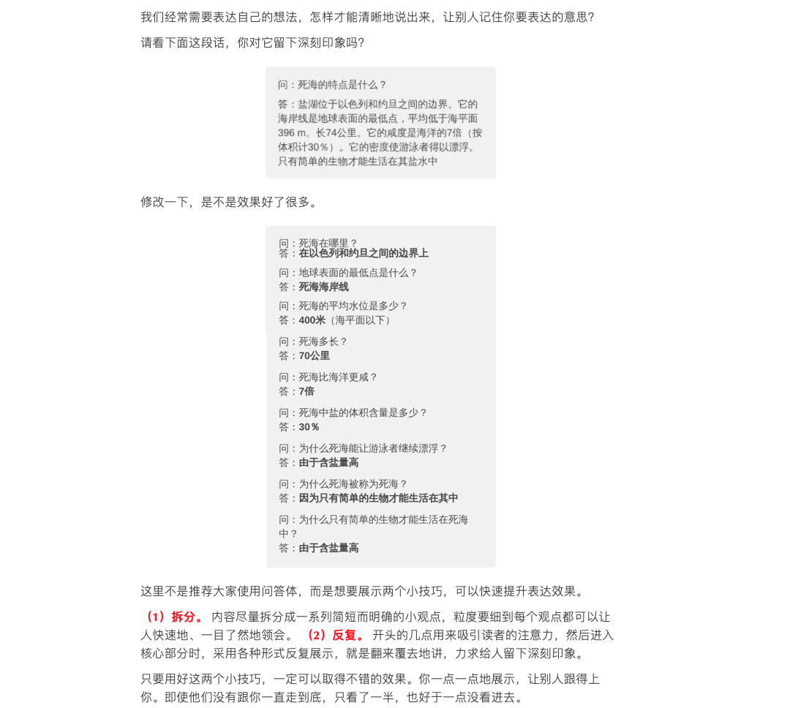

#### 一、拆分和反复可以快速提升表达技巧

这里不是推荐大家使用问答体，而是想要展示两个小技巧，可以快速提升表达效果。

**（1）拆分。** 内容尽量拆分成一系列简短而明确的小观点，粒度要细到每个观点都可以让人快速地、一目了然地领会。 

**（2）反复。** 开头的几点用来吸引读者的注意力，然后进入核心部分时，采用各种形式反复展示，就是翻来覆去地讲，力求给人留下深刻印象。

只要用好这两个小技巧，一定可以取得不错的效果。你一点一点地展示，让别人跟得上你。即使他们没有跟你一直走到底，只看了一半，也好于一点没看进去。

</img>

来源：https://mp.weixin.qq.com/s/a2rAVzwYPL9WByfO5CqOrQ
