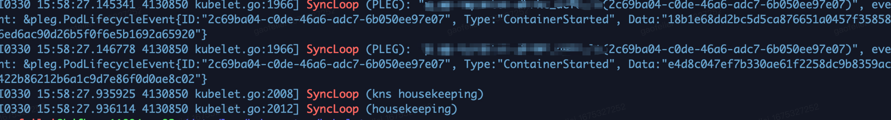
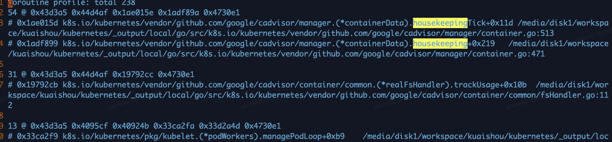
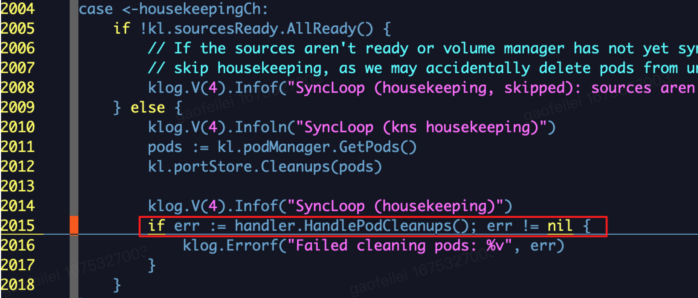
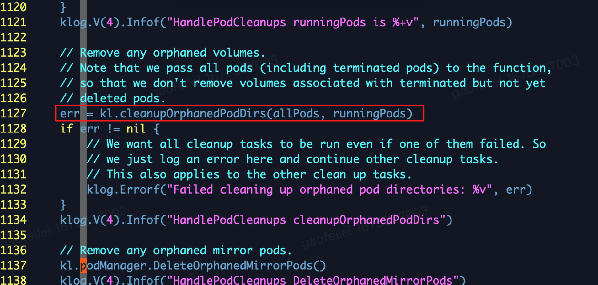
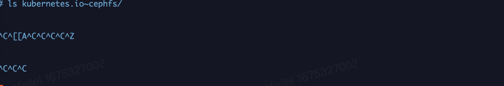

## **问题说明**


现象：pod 调度成功后，状态一直处于 pending 状态

kubelet 版本： v1.17.4

问题原因：机器上存在cephfs volume残留目录，kubelet访问cephfs volume 目录时会hang 住

影响：机器上已有实例不受影响，新调度到的实例无法创建

解决方法：使用 umount -f 强制卸载残留 cephfs 挂载目录


## **排查**

首先是看 kubelet 的日志，pod 已经分配了 node 说明已经调度成功了，一直处于 pending 状态说明对应的 node 没有 watch 到 pod 或者 apiserver 没有将新增 pod 的事件推动到 node，但是该集群只有少数几个 node 处于异常状态，可以排除 apiserver 的异常。


kubelet 处理 pod 的核心逻辑是 syncLoop 函数，kubelet 会通过循环的方式一直执行 syncLoop 函数。从日志中可以看到 kubelet 从某个时间点后就没有 Syncloop 日志了，说明 kubelet syncLoop 有问题，日志中看到执行完 housekeeping 后就没了，说明 Syncloop 卡住了或者退出了。


kubelet 历史日志中有一部分 Syncloop 日志，最新的日志文件中已经没有 Syncloop 日志了。


</img>


通过日志可以定位 kubelet 的 syncLoop 有问题，通过 metrics 可以确认是 syncLoop 异常了。

```
$ curl http://127.0.0.1:10255/healthz
[+]ping ok
[+]log ok
[-]syncloop failed: reason withheld
healthz check failed


$ tail -f kubelet.INFO | grep "sync Loop took longer than expected"
I0404 16:39:14.331705 4130850 healthz.go:177] healthz check syncloop failed: sync Loop took longer than expected
```

通过获取 kubelet 调用栈信息，可以发现卡在了 housekeeping 函数中：

```
// 获取 kubelet 调用栈
curl -Ssk --header "Authorization: Bearer ${TOKEN}" "https://127.0.0.1:10250/debug/pprof/goroutine?debug=1" > stack.txt
```


</img>


housekeeping 主要是做 pod 清理工作的，最终定位代码是卡在 housekeeping 模块下HandlePodCleanups 函数的 kl.cleanupOrphanedPodDirs() 方法中。

pkg/kubelet/kubelet.go

</img>

pkg/kubelet/kubelet_pods.go

</img>

kl.cleanupOrphanedPodDirs()  会访问残留实例的 volumes。


node 上所有实例的 volumes 信息保存在 kubelet root dir 路径下，通过测试发现某个挂载了 cephfs 的实例路径访问会 hang 住。

</img>


也可以通过执行 `strace` 命令查看 hang 住的系统调用。


在机器上执行 df 已看不到 cephfs 的挂载点，残留的 cephfs 路径可能是在删除 pod 时 umount 失败导致的。


## **结论**

kubelet 的 syncLoop 模块在执行清理 pod 操作时，卡在了删除某个 pod cephfs 挂载路径的操作中，导致 syncLoop 无法正常工作，实例的更新和清理功能失效。


挂载过 cephfs 的节点可能存在该问题，需要扫描一下线上机器。


### 其他

创建一个可以调用  kubelet 接口的 token ：

```
## kubelet api
$ kubectl create sa kubelet-api-test
$ kubectl create clusterrolebinding kubelet-api-test --clusterrole=system:kubelet-api-admin --serviceaccount=default:kubelet-api-test

$ SECRET=$(kubectl get secrets | grep kubelet-api-test | awk '{print $1}')

$ TOKEN=$(kubectl describe secret ${SECRET} | grep -E '^token' | awk '{print $2}')

$ echo ${TOKEN}

// 获取 kubelet 调用栈
curl -Ssk --header "Authorization: Bearer ${TOKEN}" "https://127.0.0.1:10250/debug/pprof/goroutine?debug=1" > stack.txt

// 获取 kubelet profile
$ curl -Ssk --header "Authorization: Bearer ${TOKEN}" 'https://127.0.0.1:10250/debug/pprof/profile?seconds=60' -o cpu.prof

// 打开火焰图
$ go tool pprof ./cpu.prof
```


