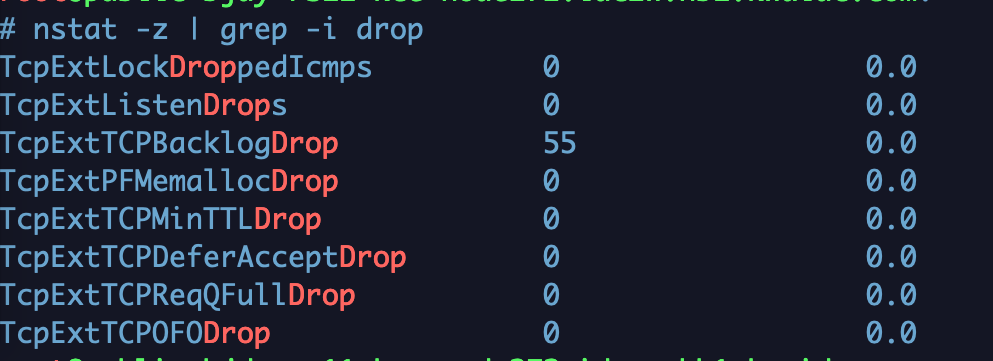

wireshark跟tcpdump原理是一致的，都是在网卡软中断里抓包的，自然就无法抓取网卡里的错误，所以通常情况下都需要在两端同时抓包来比较。

抓包，分析重传数据包：

```
# tcpdump -s 0 -i bond0 -w tcpdumpfile

# yum install wireshark

// 查看重传数据包
# tshark -r tcpdumpfile -R tcp.analysis.retransmission
```


对机器整体的分析：

```
$ dstat

// 查看 tcp 相关的信息
$ dstat --tcp

$ ss -s

dstat 与 ss 的输出不一致，需要分析下两个命令输出指标的具体含义
```


网络分析工具：nstat

```
// 查看丢包信息
# nstat -z | grep -i drop
```

</img>

java 参数设置：

```
ServerSocket serverSocket = new ServerSocket(port, backlog);

这个参数设置为-1表示无限制，默认是50个最大等待队列
```


TODO：

1、delayed ack 参数的意义；

